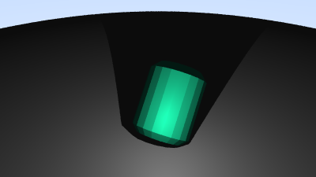
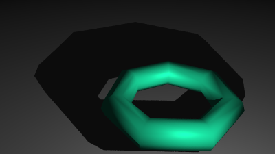
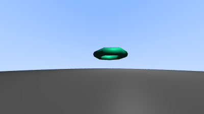

# C++ CPU Ray Tracer

A multithreaded CPU ray tracer built from scratch in C++. Designed to render still 
images of 3D scenes with objects, containing spheres and triangle meshes loaded from '.obj' files.
Capable of Row-level parallel rendering, Supersampling anti-aliasing (SSAA), Blinn-Phong shading, 
Smooth or flat shading via vertex normals.

## Results

## Core Features
 * **Multithreading** - Row partitioning across threads using 'std::thread'
 * **Geometry** - Analytic spheres and triangle meshes parsed from '.obj'.
 * **Ray-Triangle Intersection** - Möller-Trumbore algorithm for fast minimal storage
   ray-triangle intersection.
 * **Shading** - Blinn-Phong lighting model with diffuse, specular and ambient components.
 * **Shadows** - Hard shadows via shadow ray casting.
 * **Smooth and flat shading** - Barycentric interpolation of vertex normals
 * **Camera** - Fully positionable, defined by "look from", "look at" points and vertical FOV
 * **Anti-Aliasing** Supersampling anti-aliasing (SSAA) by shooting multiple
   rays per pixel.

## Desgin & Data Structures

### Design
The ray tracer follows a modular, object-oriented design, separating scene setup,
Rendering pipeline, ray-geometry intersection calculation and math utilities.

**main.cpp** - Scene definition: output file, image, camera, materials, world,
objects, lights. Allows easy experimentation without altering core logic.

**Renderer.cpp** - manages camera setup, multithreaded ray generation, 
anti-aliasing, shading and output to PPM. Multithreading splits rows across
threads for parallelism, hardcoded to 8, but configurable. Shading uses a
simple Blinn-Phong model with fixed coefficients for predictability.

**Surface.cpp** - manages geometry and intersection tests. Abstract Surface
class defines hit() interface for derived classes (Sphere, Mesh, Triangle) to
implement ray intersection test. Meshes parse '.obj' file once at construction,
store triangles in a flat list. Enables smooth shading for triangles meshes via
barycentric interpolation in hit() function of a Triangle using Möller-Trumbore
algorithm. Backface culling: Implicit via det < kEpsilon check (no backside 
rendering).

**Math utilities** - Custom Vec3 class for 3d vectors and methods to efficiently
work on them. Rgb class for colors. Ray class for parametric evaluation. Interval
for t-range clamping. As well as mathematical constants.

### Key Data Structures

**Geometry Storage**
 * **Mesh** - represents triangle meshes loaded from Wavefront .obj files. contains
   list of triangles and a material (uniform for the entire mesh). During
   construction uses temporary lists for all vertices and normals from v and vn
   lines, then makes faces by duplicating vertex/normal data into each
   triangle. Currently supports only triangles (no polygons), ignores textures,
   materials, groups.
 * **Triangle** - stores v0, v1, v2 vertices and n0, n1, n2 normals. 
 * **Sphere** - Lightweight analytic primitive, no complext parsing. Contains
   center, radius, material. Tests hits with quadratic equation solution
   with two roots, selecting the nearest in ray_t interval.

**Image buffer** - std::vector<std::vector<Rgb>> image. 2D list of Rgb values.

**World and Lights** - SurfaceGroup contains list of objects for geometry, and
list of point lights and list of ambient lights.

## Future plans
 * Bounding Volume Hierarchy
 * Physics Based Ray Traced materials

## How to run

### prerequisites
 * C++17 or newer
 * CMake 3.10 or newer

The project is using CMake. The main.cpp file contains the scene definition
(camera, world, lights, materials). To render the scene, compile and run
the resulting executable.

cmake -B build

cd build/bin

./ray_tracer
